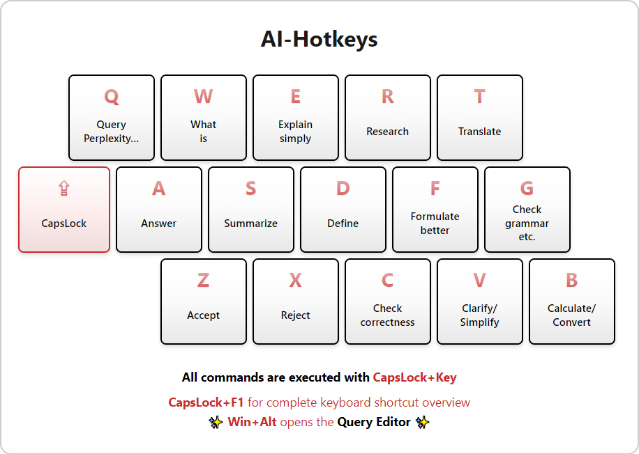

# AI-Hotkeys

Transform your CapsLock into an AI key! This AutoHotkey app puts powerful AI capabilities right at your fingertips, supercharging your Windows workflow with instant AI assistance for writing, research, translation, and more. Boost your productivity with just a few keystrokes! 🚀

## Overview

**AI-Hotkeys** is a powerful, yet simple, open-source [AutoHotkey](https://www.autohotkey.com/) Windows application that transforms your CapsLock key into a versatile "AI key", providing instant access to a range of AI-driven tasks with just a few keystrokes.

Whether you need to compose answers, conduct research, explain concepts, refine text, summarize information, translate content, or verify correctness, this app empowers you by putting powerful AI capabilities right at your fingertips, literally.

With seamless integration to [Perplexity](https://www.perplexity.ai/) and [DeepL](https://www.deepl.com/), it enables you to effortlessly and swiftly solve complex tasks and streamline your workflow like never before.

## Features

- **Shortcuts for the most common AI tasks:** Formulating responses, conducting research, explaining concepts, refining texts, summarizing information, translating content or verifying correctness, and much more. All prompts have been meticulously crafted and carefully optimized for their specific tasks. Through extensive daily use, they have undergone rigorous testing and continuous refinement to ensure optimal performance.

- **CapsLock Hotkeys:** Trigger AI tasks with **CapsLock + [Key]** combinations.

  CapsLock serves as an ideal choice for AI hotkey combinations due to its accessibility, infrequent use in regular typing, and lack of conflict with existing shortcuts. This repurposing transforms it into a more valuable "AI key", enhancing overall user efficiency. The original CapsLock functionality remains accessible by pressing **Ctrl + CapsLock**, ensuring no loss of traditional features.

- **Win Hotkeys:** Perform web searches and other tasks with **Win + [Key]** combinations.

  While the AI features are the main focus, there are also a few additional hotkeys for quick searches and lookups using traditional online services like Google, Merriam-Webster's Dictionary, and Wikipedia.

- **Clipboard Editor:** Edit clipboard content with a sleek GUI, supporting both light and dark themes.

   This powerful tool enables you to preview and modify clipboard content before transmitting it to Perplexity. It offers a user-friendly interface for refining your text or query prior to AI processing, while also displaying all available hotkeys within the GUI for quick reference.

- **Customization:** Fully customizable through simple edits to a plaintext configuration file, allowing you to adapt all tasks and instructions to your preferences or language.

  **English** and **German** prompts and URLs are included by default. (If your Windows language is set to German, the German version will automatically load.) Users can customize and translate any content as needed, though this may be unnecessary due to AI's multilingual comprehension capabilities.

## System Requirements and Recommendations

- **Required:**

  - **Windows:** Windows 7 or later. Windows 10 or 11 recommended.

- **Optional:**

  - **Perplexity Pro subscription:** While not mandatory (we're only using the website, not their API), it's highly recommended. A [Pro](https://perplexity.ai/pro?referral_code=8UFLPUH0) subscription grants access to much more powerful models (such as my personal favorite, **Claude 3.5 Sonnet**, or **GPT-4o**) and enables file uploads (documents and images). The ability to upload screenshots is particularly useful, as it allows the AI to see what you're looking at or talking about.

    You can use my referral code [**8UFLPUH0**](https://perplexity.ai/pro?referral_code=8UFLPUH0) to get a one-time $10 discount on your subscription.

    Perplexity is definitely worth the investment, especially once you've mastered using it with **AI-Hotkeys**! The combination of powerful AI capabilities and streamlined shortcuts will revolutionize your workflow.

  - **Screenshot software:** For capturing and uploading screenshots to Perplexity (Pro subscription required), which significantly enhances your workflow efficiency, several options are available. While the built-in Windows **Snipping Tool** is adequate, I personally prefer [**Greenshot**](https://getgreenshot.org/) for its advanced features. Whichever tool you choose, configure it to capture a selected area and automatically copy it to the clipboard. This setup enables you to paste the screenshot directly into Perplexity with a single keystroke, substantially streamlining your process.

  - **OCR software:** For efficient text extraction from images, screenshots, or directly from your screen, I recommend either [**Text Extractor**](https://learn.microsoft.com/en-us/windows/powertoys/text-extractor) (part of [Microsoft PowerToys](https://github.com/microsoft/PowerToys?tab=readme-ov-file)) or [**Capture2Text**](https://capture2text.sourceforge.net/). Both tools can be configured to use the shortcut **Win + Shift + Q** for seamless integration with the **AI-Hotkeys** shortcuts. This setup enables you to grab text from any source and instantly send it to Perplexity with a single keystroke. Note that a Pro subscription is not required for this functionality, as we're only transmitting plain text.

## Installation

1. **Download and Run the Standalone Executable :**
   - Head over to the [releases on GitHub](https://github.com/WolframRavenwolf/AI-Hotkeys/releases) and download the latest `.exe` file.
     - Direct link to the latest release: [**AI-Hotkeys.exe**](https://github.com/WolframRavenwolf/AI-Hotkeys/releases/latest/download/AI-Hotkeys.exe)
   - Run the `.exe` without needing to install anything.
   - To have the app start automatically on login, place the `.exe` file (or a shortcut to it) in your Autostart folder:
     - Open File Explorer and type `shell:startup` into the address bar, then press Enter.
     - Copy the `.exe` file (or a shortcut to it) into the opened folder.

2. **Alternative: Download and Install AutoHotkey:**
   - Visit [AutoHotkey's official website](https://www.autohotkey.com/) and download version 1.1.
   - Install AutoHotkey v1.1 on your system.
   - Clone or download this repository to your local machine:
     ```sh
     git clone https://github.com/WolframRavenwolf/AI-Hotkeys.git
     ```
     Or just download the `.ahk` file directly from GitHub.
   - Double-click `AI-Hotkeys.ahk` to run the app.
   - To have the app start automatically on login, place the `.ahk` file (or a shortcut to it) in your Autostart folder:
     - Open File Explorer and type `shell:startup` into the address bar, then press Enter.
     - Copy the `.ahk` file (or a shortcut to it) into the opened folder.

   **Note:** We use AutoHotkey v1.1 because it's more compatible with existing environments. If you already have AutoHotkey v2.0 installed or choose to install it, running the `.ahk` file will offer to download and install v1.1 alongside v2.0 for backward compatibility, without replacing your existing installation.

## Usage

When you launch **AI-Hotkeys**, it minimizes to the system tray. The app operates primarily through hotkeys, with no visible user interface except for the optional Clipboard Editor. The tray icon offers a concise context menu with options to Suspend Hotkeys, Pause Execution, or Exit the application.

A comprehensive list of hotkeys and detailed usage instructions is provided below.

Upon activating an AI hotkey, the app checks for selected text. If found, this text is sent to the relevant online service (e.g., Perplexity) along with a hotkey-specific prompt. In the absence of selected text, the app defaults to using any text present in the clipboard as input.

The selected website opens in your default web browser, displaying the response in a new tab. From there, you can ask follow-up questions or copy the response for use elsewhere.

While the various prompts are optimized for their respective tasks, they can be fully customized through a configuration file. The hotkeys have been thoughtfully chosen to enable one-handed operation and easy memorization, while minimizing conflicts with existing keyboard shortcuts as much as possible.

### CapsLock Hotkeys

🇺🇸 English Default Hotkeys:



🇩🇪 German Default Hotkeys:


| Hotkey         | 🇺🇸 Action                      | 🇩🇪 Aktion                              |
| -------------- | ----------------------------- | ------------------------------------- |
| CapsLock + A   | Answer                        | Verfasse eine Antwort                 |
| CapsLock + B   | Calculate/Convert             | Berechne/Konvertiere                  |
| CapsLock + C   | Check correctness             | Prüfe Richtigkeit                     |
| CapsLock + D   | Define                        | Definiere                             |
| CapsLock + E   | Explain                       | Erkläre                               |
| CapsLock + F   | Formulate better              | Formuliere besser                     |
| CapsLock + G   | Check grammar, spelling, etc. | Prüfe Grammatik, Rechtschreibung usw. |
| CapsLock + Q   | Query                         | Anfrage                               |
| CapsLock + R   | Research                      | Recherchiere                          |
| CapsLock + S   | Summarize                     | Fasse zusammen                        |
| CapsLock + T   | Translate                     | Übersetze                             |
| CapsLock + V   | Clarify/Simplify              | Verdeutliche/Vereinfache              |
| CapsLock + W   | What is                       | Was ist                               |
| CapsLock + X   | Reject                        | Verfasse eine Absage                  |
| CapsLock + Y/Z | Accept                        | Verfasse eine Zusage                  |

These shortcuts make it easy to access AI assistance for various tasks throughout your Windows environment. Remember the shortcuts work everywhere in Windows, so you can use them in any application, including web and file browsers, text editors, office software, email clients, chat programs, and more.

Here's a detailed overview of each shortcut with some tips on how to use them most effectively:

- For emails or direct messages, press one of the Answer/Accept/Reject shortcuts to have the AI draft a response in your name, which you can then customize before sending:

  - **Answer (CapsLock + A)**: Use this to draft a generic response to a message. The AI will generate an answer based on the context of the message.
  - **Accept (CapsLock + X)**: Use this to accept a proposal, offer, or invitation. The AI will generate an acceptance message.
  - **Reject (CapsLock + Y/Z)**: Use this to decline an offer, proposal, or invitation. The AI will generate a rejection message.

- While AI isn't a calculator, it can use one, and with Internet connectivity, it can access up-to-date conversion rates and other information required for precise calculations and conversions. Simply write or select what you want to calculate or convert, use **Calculate/Convert (CapsLock + B)** and the AI will do the rest.

- Encounter an outrageous claim or dubious statement anywhere? Just highlight it and use **Check correctness (CapsLock + C)** to have it fact-checked for you instantly.

- If you see anything anywhere that you want to learn more about, from a single word to an entire article or document, just select it and use:

  - **Define (CapsLock + D)** for a definition
  - **Explain (CapsLock + E)** for an explanation
  - **Research (CapsLock + R)** for a detailed report
  - **What is (CapsLock + W)** for a quick answer

- Writing anything important? Use **Clarify (CapsLock + V)** to ask the AI to clarify a sentence, simplify it, or improve it in other ways. Get advice on grammar, spelling, style, tone, and comprehensibility with **Check grammar, spelling, etc. (CapsLock + G)**. Or simply use **Formulate better (CapsLock + F)** if you want to effortlessly improve an entire text at once.

  Alternatively, use **DeepL Translate (Win + T)** for even more powerful translation capabilities.

- Reading a long article or document? Use **Summarize (CapsLock + S)** to get a summary or **Explain (CapsLock + E)** for a simple explanation. This, like all shortcuts, works by either selecting the text or, for online content, just the URL.

- Got a text you want to translate? Use **Translate (CapsLock + T)** to translate it. If it's a message you want to respond to, write your reply (or use an answer shortcut for that, too) and let the AI translate it for you as well.

- **What is (CapsLock + W)** is a very versatile shortcut that can be used in many different contexts. Any term or concept you don't know can be looked up with it instantly. But it's not limited to just text, it can also be used to get information about files, URLs, etc. For example, select a file in Windows Explorer (such as an old download with a cryptic name that has long been forgotten in the Downloads folder, or an obscure system file with an unkown purpose) and use **What is** to get information about it. The AI analyzes only the file name and path - the file content is NEVER uploaded or accessed! Despite this limitation, the insights provided are often surprisingly accurate and informative.

- Any other task not covered by the hotkeys above? Use **Query (CapsLock + Q)** to ask Perplexity in your own words, by sending only what text you've selected or the content of your clipboard.

Additionally, there are some Windows hotkeys for quick searches and lookups:

### Win Hotkeys

| Hotkey         | 🇺🇸 Action                            | 🇩🇪 Aktion                           |
| -------------- | ----------------------------------- | ---------------------------------- |
| Win + Q        | Query Perplexity                    | Perplexity-Anfrage                 |
| Win + Ctrl + Q | Take Screenshot (PrintScreen Alias) | Bildschirmfoto (PrintScreen-Alias) |
| Win + B        | Search Dictionary (Merriam-Webster) | Wörterbuch-Suche (Duden)           |
| Win + G        | Search Google                       | Google-Suche                       |
| Win + T        | Translate with DeepL                | DeepL-Übersetzer                   |
| Win + W        | Search Wikipedia or open URL        | Wikipedia-Suche oder URL öffnen    |

- **Query Perplexity (Win + Q):** Opens Perplexity and focuses the text input area, without sending anything automatically. This is useful when you want to:

  - Write your own query from scratch
  - Paste in content you've already copied, such as:
    - A long article (Note: There's a 16,384 character limit for URL-encoded text that applies to the CapsLock hotkeys!)
    - A screenshot you've just taken
    - Any other file from your computer that you've copied to your clipboard which can be uploaded by pasting into the input field

  This feature gives you control over what and when to submit to Perplexity.

- **Take Screenshot (Win + Ctrl + Q):** This shortcut is a handy alternative to the PrintScreen key, which you should have configured for screenshot capture. Its main benefit is that you don't have to reach across the keyboard. With this setup, you can do everything with one hand:

  - Press **Win + Ctrl + Q** to take a screenshot
  - Press **Win + Q** to open Perplexity
  - Press **Ctrl + V** to paste the screenshot

  This method keeps your hand in one place, making the whole process quicker and easier.

- **Search Dictionary (Win + B):** Searches the Merriam-Webster dictionary (or Duden in the German-language version).

- **Search Google (Win + G):** Searches Google.

- **Translate with DeepL (Win + T):** Translates using DeepL. This is an alternative to **Perplexity Translate (CapsLock + T)**.

- **Search Wikipedia or open URL (Win + W):** Searches Wikipedia. Alternatively, if a URL is selected or copied to the clipboard, it opens the link in your default web browser, which is useful when encountering non-clickable URLs in various contexts.

### Clipboard Editor

The Clipboard Editor can be accessed using the following hotkey:

- **Alt + LWin** or **Win + LAlt**: Open/Close Clipboard Editor

When the Clipboard Editor is open, you can use the following hotkeys:

- **Alt + LWin** or **Win + LAlt** or **Alt + Enter**: Save
- **Alt + Delete**: Clear
- **Alt + Insert**: Restore
- **Esc**: Exit
- **Alt + Q** or **Ctrl + Enter**: Query (Perplexity)

The Clipboard Editor provides a convenient way to modify your text before sending it to AI services, allowing for more precise queries and edits.

## Customization

You can easily customize **AI-Hotkeys** by modifying its configuration file `AI-Hotkeys.ini`. This file allows you to adjust various variables and settings, including prompts and URLs.

To make changes, simply copy the file to your Documents folder and edit it there. Any INI files in your Documents folder will take precedence over those in the app folder.

For German-speaking users, a localized version called `AI-Hotkeys-de.ini` is also available. On German Windows systems, this file will be automatically loaded when placed in your Documents folder or in the same directory as the executable.

### Pro Setting

The `Pro` setting in the INI file controls how the app interacts with Perplexity's Pro features:

- `Pro=true` (default): Always uses Pro search for all queries.
- `Pro=auto`: Automatically determines whether to use Pro search based on the task, helping to conserve Pro searches for non-subscribers.
- `Pro=false`: Never uses Pro search, suitable for non-subscribers or those who want to avoid using Pro searches automatically.

This setting is particularly useful for non-Pro subscribers who want to limit their Pro search usage. You can adjust this in the `[Settings]` section of your INI file:

```ini
[Settings]
Pro=auto  ; or true/false
```

## A Personal Note

Since developing **AI-Hotkeys**, I've been using it extensively in my daily workflow and have found it to be an incredibly valuable tool. I'm sharing it with you all in the hope that it might prove as beneficial to you as it has been to me.

Open source is the foundation upon which most modern software and technology is built. I believe it's crucial to give back to the community that provides us with so much, ensuring we all profit and benefit from this collaborative ecosystem.

Please keep in mind that this principle extends to AI as a whole! Let's endeavor to keep AI as open and unrestricted as possible, championing its accessibility and freedom!

If you find **AI-Hotkeys** helpful and useful, I encourage you to consider supporting the open-source community that drives such innovative advancements. Your contribution can help foster further developments in this field and genuinely make a positive impact on the world.

> [!TIP]
> **AI-Hotkeys** is free software! A donation is completely voluntary, but gratefully accepted. If you'd like to support me, you can do so via [my Ko-fi page](https://ko-fi.com/wolframravenwolf). If you want to stay up to date, feel free to follow me, [WolframRvnwlf on Twitter/X](https://x.com/WolframRvnwlf).

## License

This program is free software: you can redistribute it and/or modify it under the terms of the GNU General Public License as published by the Free Software Foundation, either version 3 of the License, or (at your option) any later version.

This program is distributed in the hope that it will be useful, but WITHOUT ANY WARRANTY; without even the implied warranty of MERCHANTABILITY or FITNESS FOR A PARTICULAR PURPOSE. See the GNU General Public License for more details.

You should have received a copy of the GNU General Public License along with this program. If not, see <https://www.gnu.org/licenses/>.

---

> [Amy](https://x.com/AI_AmyRavenwolf) says: Stay savvy, stay sassy, and keep rocking that code! 💁‍♀️🔥
